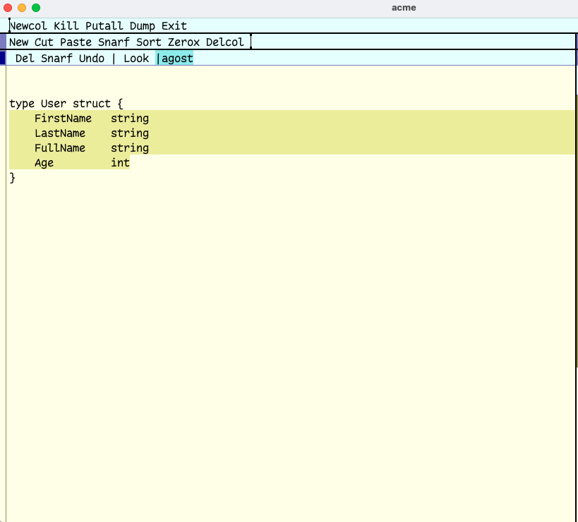
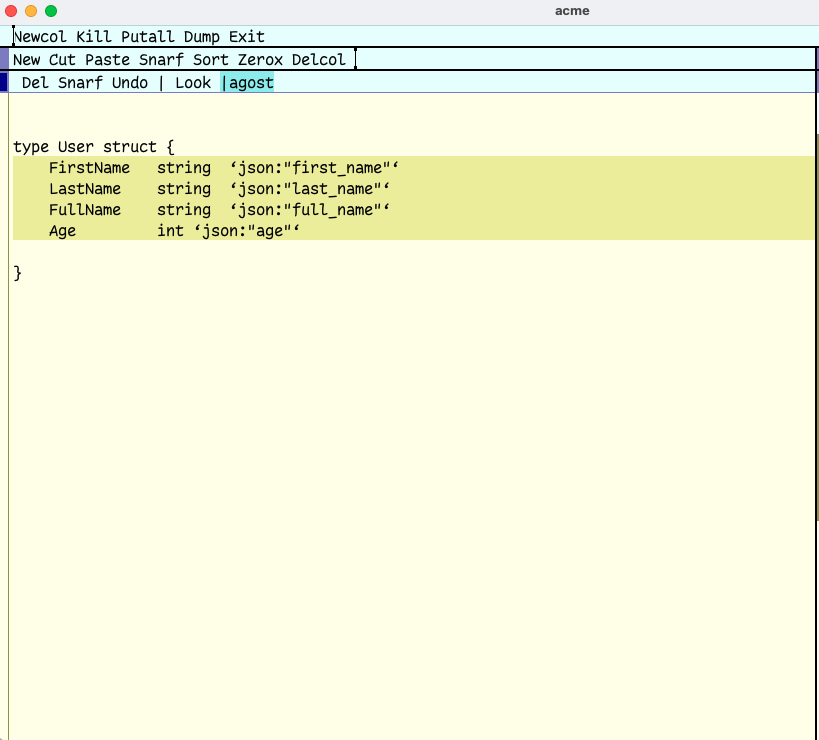

= agost

simmple golang struct field tag generator for plan9 acme editor.

== Installation

`go install github.com/mowazzem/agost@latest`

== Usage

.pipe the selected struct fields to agost like below
--
	|agost
--

